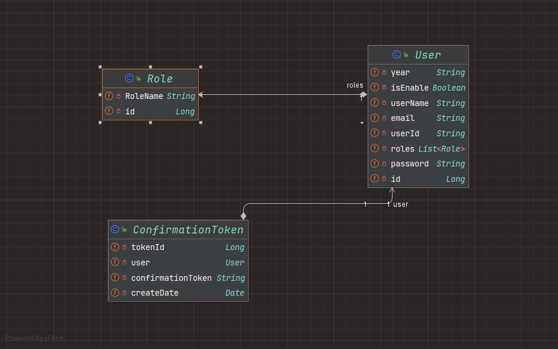
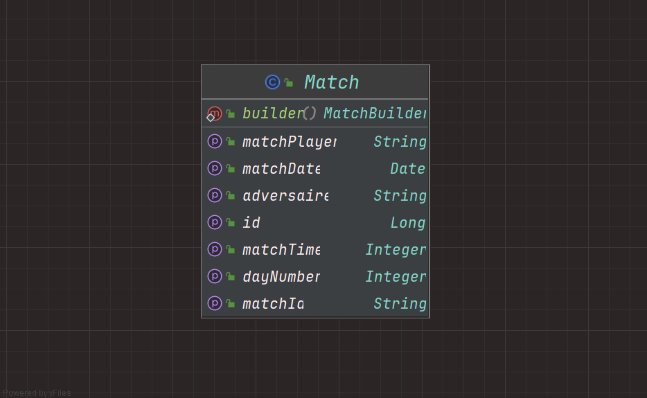

# Reservation Terrain - Backend

This is the backend part of the **Reservation Terrain** project, developed using **Spring Boot** and **MySQL**. The project provides a comprehensive solution for managing and reserving sports terrains.

## Project Overview

The **Reservation Terrain** system is designed to simplify the process of booking sports fields. It includes functionalities for user authentication, match scheduling, and reservation management.

### Technologies Used

- **Spring Boot**: For building the backend services.
- **MySQL**: For database management.
- **JWT**: For secure user authentication.
- **OAuth2 Resource Server**: For managing OAuth2 tokens and securing the API endpoints.

### Project Architecture

The overall architecture of the project is designed to be modular and scalable. The key components are as follows:

1. **Security**: Handles user authentication and authorization.
2. **Match Management**: Manages the scheduling and reservation of matches.
3. **User Management**: Manages user data and roles.

### Security Component

The security component of the project is implemented using **JWT** (JSON Web Tokens) and **OAuth2 Resource Server**. This ensures that all API endpoints are secured and that only authenticated users can access certain resources.



### Match Management

The match management component is centered around a single, comprehensive table that stores all information related to matches, including match times and days. This approach simplifies data retrieval and management.



## Getting Started

### Prerequisites

To set up the project locally, ensure you have the following installed:

- Java 21
- Maven 3.x.x
- MySQL 8.0

### Installation

1. Clone the repository:

   ```bash
   git clone git@github.com:AbdelilahSaouiri/terrain-ensah-backend.git
   ```
